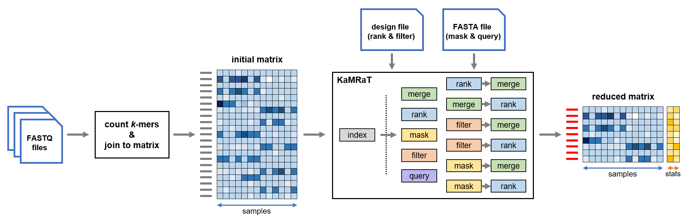

# KaMRaT

-----
KaMRaT is a C++ tool for finding substrings with interesting properties in large NGS datasets. 

KaMRaT requires a k-mer count matrix extracted from the NGS files (e.g. with Jellyfish), and potential design table or FASTA file (see below for more information). 

KaMRaT then provides a set of tools for reducing the k-mer matrix and extending k-mers to longer contigs. The main modules are:

- kamrat index: index feature* count table on disk
- kamrat filter: remove/retain features* by expression level 
- kamrat mask: remove/retain k-mers matching given fasta sequences
- kamrat merge: merge k-mers into contigs
- kamrat score: score features* by classification performance, statistical significance, correlation, or variability 
- kamrat query: estimate count vectors of given list of contigs

  Note: \*	features can be not only k-mers or k-mer contigs, but also general features such as genes or transcripts.

KaMRaT means "k-mer Matrix Reduction Toolkit", or "k-mer Matrix, Really Tremendous !".

KaMRaT has been published on [*Bioinformatics*](https://academic.oup.com/bioinformatics/article/40/3/btae090/7623008).

KaMRaT is in **The MIT License**, as described [here](https://github.com/Transipedia/KaMRaT/blob/master/docs/COPYRIGHTS).

-----

**Note: this page contains a TL;DR version of the software installation and usages. Please refer to our [Wiki page](https://github.com/Transipedia/KaMRaT/wiki) for detailed information.**

## Software structure
KaMRaT is designed as a flexible toolkit for combinations of different operations. The workflow always starts from index, then other operations can be combined according to user's analysis design, including:

- a single operation of filter, mask, merge, score or query;
- filter-merge or filter-rank;
- mask-merge or mask-rank;
- merge-rank;
- rank-merge.



### Tips for the choice of k-mer length
Currently, KaMRaT only accepts k-mers no longer than 32nt, since the k-mers are coded in an uint64 variable.

Besides, we recommend users to choose k as an odd number, to avoid confounding one k-mer with its reverse complement counterpart in unstranded data. For example, in the situation k=6, 6-mers such as AAATTT lose information of their strandedness.

## Modifications since Version 1.1.0
This section describes modifications from release KaMRaT `v1.1.0` (both on GitHub and DockerHub) to the current version of GitHub `master` branch and DockerHub image tagged `latest`.

We will update this section to "None" when the next KaMRaT version is released.

### KaMRaT index
Bugfix:
- revCompFastq.pl line 39 should be `if($i % 4 == 3) {` (since commit 99ad207e9f17b798fd245aef5581bed0e76c1333).

Others:
- KaMRaT index checks if the selected k-mer length is no longer than 31nt (since commit 169d6e38ff583dafedfa2abd405b4ef4b59978dc).
- DockerFile: added python3-pip for snakemake installation (since commit b628a76cc25dab7a403172521c12be353ac2d2e3).

## Installation
It's highly recommended to directly use KaMRaT within `apptainer`/`singularity` container for users at any level unless the task involves in software development, because:

1. Building the container is simple and only requires the dependency of `apptainer`/`singularity` which should be pre-installed on most of HPC clusters.
2. Usage of KaMRaT in container ensures better reproducibility of results.
3. Several companion scripts can be easily run within the container, e.g., for input k-mer matrix construction.

Pre-built image is provided on `DockerHub`. To build in local, please run:

```bash
apptainer build KaMRaT.sif docker://xuehl/kamrat:latest
    # alternatively to build singularity image: simply replace "apptainer" to "singularity"
```

Please refer to our [Wiki page](https://github.com/Transipedia/KaMRaT/wiki/1.-Software-Installation) for:
- more detailed information on KaMRaT usage within `apptainer`/`singularity` container;
- alternatively way of installation by building the software from source.

## Usage
KaMRaT can be run generally in the fashion:

``` bash
apptainer exec -B /bind_src:/bind_des kamrat <CMD> [options] /path/from/{bind_des}/to/input/kmer/table 
    # <CMD> can be one of index, filter, mask, merge, score, query
    # replace "apptainer" to "singularity" when KaMRaT is built by singularity
```

The top-level helper is reachable by:

``` bash
apptainer exec kamrat
```

Helpers of specific KaMRaT modules are accessible via:

``` bash
apptainer exec kamrat <CMD>
    # <CMD> can be one of index, filter, mask, merge, score, query
```

Please refer to our [Wiki page](https://github.com/Transipedia/KaMRaT/wiki/2.-Software-Usage) for detailed software usage description.

Demostrations of example usecases can be found [here](https://github.com/Transipedia/KaMRaT/wiki/3.-Workflow-Demos).

## Software/Library Citations

Armadillo:

+ Conrad Sanderson and Ryan Curtin. Armadillo: a template-based C++ library for linear algebra. Journal of Open Source Software, Vol. 1, pp. 26, 2016.
+ Conrad Sanderson and Ryan Curtin. A User-Friendly Hybrid Sparse Matrix Class in C++. Lecture Notes in Computer Science (LNCS), Vol. 10931, pp. 422-430, 2018.

[Boost C++ Library](https://www.boost.org/)

DE-kupl: Audoux, J., Philippe, N., Chikhi, R. et al. DE-kupl: exhaustive capture of biological variation in RNA-seq data through k-mer decomposition. Genome Biol 18, 243 (2017).

MLPack: R.R. Curtin, M. Edel, M. Lozhnikov, Y. Mentekidis, S. Ghaisas, S. Zhang. mlpack 3: a fast, flexible machine learning library. Journal of Open Source Software 3:26, 2018.
