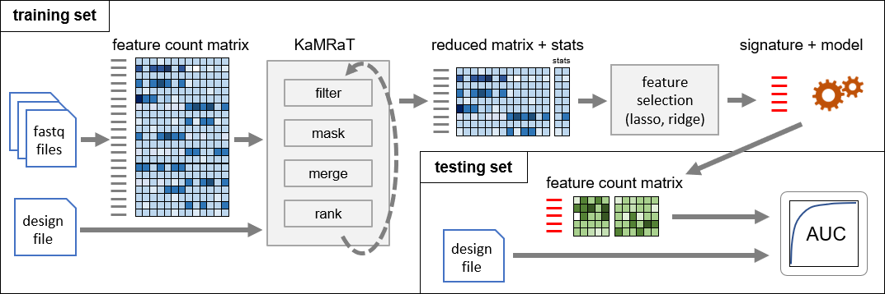

# KaMRaT

k-mers are the substrings of a fixed length *k* along biological sequences.

Transcriptomics analysis based on k-mer count possesses good potential for capturing signals at nucleotide resolution. But a current challenge is that number of k-mer is too many and length of k-mer is too short.

KaMRaT provides a set of tools for k-mer matrix reduction, for reducing k-mer number and extending k-mers to longer contigs.

The name KaMRaT means k-mer Matrix Reduction Toolkit, or k-mer Matrix, Really Tremendous !.

## Typical KaMRaT Workflow



## Installation

<details>
<summary>Build from source</summary>

### Dependencies

+ [MLPack 3.3.2](https://github.com/mlpack/mlpack/releases/tag/3.3.2)
+ [Boost-iostreams](https://www.boost.org/doc/libs/1_74_0/libs/iostreams/doc/index.html)

MLPack can be installed on [Linux/Mac](https://mlpack.org/doc/mlpack-3.3.2/doxygen/build.html), [Windows](https://mlpack.org/doc/mlpack-3.3.2/doxygen/build_windows.html), or via [conda](https://anaconda.org/conda-forge/mlpack) by following the corresponding links.  
If you are installing MLPack with conda, please add the following line into your `.bashrc` file in the `home/` directory before compiling KaMRaT:

``` bash
export LD_LIBRARY_PATH=/path_to_conda_env/mlpack/lib:$LD_LIBRARY_PATH
```

### Clone and Build

Firstly, clone the repository:

``` bash
git clone --recursive https://github.com/Transipedia/KaMRaT.git
cd KaMRaT
```

If you installed MLPack library with conda:

``` bash
bash compile.bash /path_to_MLPack_conda_environment
```

Otherwise, if you installed MLPack without conda:

``` bash
bash compile.bash
```

Finally, an executable binary file is available as `bin/kamrat`.

</details>

<details>
<summary>Use singularity</summary>

Hello world !

</details>

## General Information

### Sample Information File

The sample-info file is indicated by the option `-smp-info`. This file aims to indicate which columns in the k-mer count matrix should be considered as sample columns. Please do not put any header line in the file, since the columns are already defined by convention as below.  

+ If the file contains only one column, it indicates sample names, and all samples are considered as the same condition
+ If the file contains two columns, the first column corresponds to sample names, and the second conrresponds to conditions
+ If the file is not provided, all columns in the matrix apart from the first one are considered as samples

### Input Count Matrix for KaMRaT

The input count matrix should be in .tsv or .tsv.gz format, in which the fields are separated by tabulation character.  
In the matrix, features are presented as rows, and samples as columns. The first column in matrix should always be the feature column (sequences or feature names).  
KaMRaT accepts extra columns representing non-count values, e.g. feature's p-value, score, etc. In this case, a smp-info file is mandatory for indicating which columns are the count columns.

### Output Count Matrix by KaMRaT

The output count matrix is also in .tsv format, where the fields are separated by tabulation character.  
In the matrix, the reduced features are presented as rows, and the columns are in same order as the input.  
KaMRaT guarantees the information of output matrix coherent with the input matrix. For KaMRaT-rank, though there are steps of count normalization, log transformation and standardization for score evaluation, the count values in output matrix are kept same as input (raw count).

## Usage

Note: if you use KaMRaT in command line, please remember to indicate the full path to KaMRaT binary file.

### KaMRaT Execution

We recommande using KaMRaT within ```singularity```:

``` bash
singularity exec -B /bind_src:/bind_des kamrat <CMD> [options] input_table 
# <CMD> can be one of filter, mask, merge, rank
```

The ```-B``` option is for binding disk partitions to singularity image, please check ```singularity``` helper for details:

```bash
singularity exec -h
```

It's also executable directly on command line:

```bash
/path_to_KaMRaT_bin_dir/kamrat <CMD> [options] input_table 
# <CMD> can be one of filter, mask, merge, rank
```

In the following sections, we present under the situation of using KaMRaT in ```singularity```.  
For running it directly on command line, please replace the leading ```singularity exec -B /bind_src:/bind_des``` by the path to KaMRaT binary file.

### KaMRaT Helper

KaMRaT's top-level helper is accessible by typing one of these commands:

``` bash
singularity exec kamrat
singularity exec kamrat -h
singularity exec kamrat -help
```

Helpers of each KaMRaT modules are accessible via:

``` bash
# <CMD> can be one from filter, mask, merge, rank #
singularity exec kamrat <CMD> -h
singularity exec kamrat <CMD> -help
```

### KaMRaT Usage by Module

</details>

<details>
<summary>filter: Select expressed/silenced features* that filter through given criteria</summary>

```text
[USAGE]    singularity exec -B /bind_src:/bind_des kamrat filter -filter-info STR [-options] KMER_TAB_PATH

[OPTION]   -h,-help               Print the helper
           -filter-info STR       Filter-info path, should be a table of two columns WITHOUT header row, MANDATORY
                                      the first column should be sample names
                                      the second column should be either UP or DOWN (all capital letters)
                                          samples with UP will be considered as up-regulated samples
                                          samples with DOWN will be considered as down-regulated samples
                                          samples not mentioned in the file will not taken into consideration (being neutral)
                                          samples can also be all UP or all DOWN
           -up-min INT1:INT2      Up feature lower bound, [by default 1:1 (no filter)]
                                      print the feature if at least (>=) INT1 UP-samples have count >= INT2
           -down-max INT1:INT2    Down feature upper bound [by default 1:inf (no filter)]
                                      print the feature if at least (>=) INT1 DOWN-samples have count <= INT2
           -out-path              Output table path [default: output to screen]
```

</details>

<details>
<summary>mask: Reserve or remove k-mers with a given list of sequences</summary>

```text
[Usage]    singularity exec -B /bind_src:/bind_des kamrat mask -klen INT -fasta STR [-options] KMER_TAB_PATH

[Option]    -h,-help         Print the helper
            -klen INT        Length of k-mers, mandatory
            -fasta STR       Sequence fasta file as the mask, mandatory
            -unstrand        If k-mers are generated from unstranded RNA-seq data
            -reverse-mask    Reverse mask, to select the k-mers in sequence fasta file
            -out-path        Output table path [default: output to screen]
```

</details>

<details>
<summary>merge: Extend k-mers into contigs according to their overlap</summary>

```text
[Usage]    singularity exec -B /bind_src:/bind_des kamrat merge -klen INT -idx-path STR [-options] KMER_TAB_PATH

[Option]    -h,-help              Print the helper
            -klen INT             k-mer length (max_value: 32)
            -idx-path STR         Temporary file path for saving count index, mandatory
            -unstrand             If the k-mers are generated from non-stranded RNA-seq data
            -min-overlap INT      Min assembly overlap (max_value: k) [floor(k/2)]
            -smp-info STR         Sample-info path, either list or table with sample names as the first column
                                      if absent, all columns except the first one in k-mer count table are taken as samples
            -interv-method STR    Intervention method (none, pearson, spearman, mac) [none]
                                      the threshold can be precised after a ':' symbol
            -quant-mode STR       Quantification mode (rep, mean) [rep]
            -rep-name STR         Representative value column name, k-mer input order as rep-val by default
            -out-path STR         Output contig count table path [default: output to screen]
```

</details>

<details>
<summary>rank: Score and sort features* by count variability or association to sample conditions</summary>

```text
[USAGE]   singularity exec -B /bind_src:/bind_des kamrat rank -idx-path STR -nf-path STR [-options] FEATURE_TAB_PATH

[OPTION]        -h,-help             Print the helper 
                -idx-path STR        Temporary file path for saving count index [MANDATORY]
                -nf-path             Output path for nomalization factor [MANDATORY]
                -smp-info STR        Path to sample-condition or sample file, without header line
                                         if absent, all columns except the first in the count table are regarded as sample
                -score-method STR    Evaluation method to use and its parameter, seperated by ':' (cf. [EVAL. METHOD])
                -top-num INT         Number of top features to select
                -ln                  Apply ln(x + 1) transformation for score estimation [false]
                -standardize         Standarize count vector for score estimation [false]
                -no-norm             Estimate scores with raw count, do NOT apply normalization
                -out-path STR        Output table path [default: output to screen]
                                         the output counts are same as the input counts,
                                         normalization, log transformation, and standardization affect score evaluation, but not output counts

[EVAL. METHOD]  rsd                  Relative standard deviation
                ttest                T-test between conditions (ln transformation is required)
                snr                  Signal-to-noise ratio between conditions
                lrc:n_fold           F1-score with regression classification [default n_fold = 1]
                                         if n_fold = 0, leave-one-out cross-validation is applied
                                         if n_fold = 1, evaluation without cross-validation, training and testing on the whole datset
                                         if n_fold >= 2, n-fold cross-validation is applied
                nbc:n_fold           F1-score with naive Bayes classification [default n_fold = 1]
                                         if n_fold = 0, leave-one-out cross-validation is applied
                                         if n_fold = 1, evaluation without cross-validation, training and testing on the whole datset
                                         if n_fold >= 2, n-fold cross-validation is applied
                svm                  Hinge-loss function on SVM classification (standardization is required)
                colname:sort_mode    User-defined method, where name indicates a column in the k-mer count table
                                         sore_mode can be:    dec        Sorting by decreasing order
                                                              dec_abs    Sorting by decreasing order but on the absolute value
                                                              inc        Sorting by increasing order
                                                              inc_abs    Sorting by increasing order but on the absolute value
```

</details>

\* The feature count matrix can be not only k-mer count matrix, but any kind of count matrix once the first column represents the feature (gene, transcript, etc.)

## Software/Library Citations

Armadillo:

- Conrad Sanderson and Ryan Curtin. Armadillo: a template-based C++ library for linear algebra. Journal of Open Source Software, Vol. 1, pp. 26, 2016.
- Conrad Sanderson and Ryan Curtin. A User-Friendly Hybrid Sparse Matrix Class in C++. Lecture Notes in Computer Science (LNCS), Vol. 10931, pp. 422-430, 2018.

[Boost C++ Library](https://www.boost.org/)

DE-kupl: Audoux, J., Philippe, N., Chikhi, R. et al. DE-kupl: exhaustive capture of biological variation in RNA-seq data through k-mer decomposition. Genome Biol 18, 243 (2017).

MLPack: R.R. Curtin, M. Edel, M. Lozhnikov, Y. Mentekidis, S. Ghaisas, S. Zhang. mlpack 3: a fast, flexible machine learning library. Journal of Open Source Software 3:26, 2018.
